# Nero1l

正在学习，偶尔过拟合。
*Always learning. Occasionally overfitting.*

电子科技大学 UESTC · 本科
*Bachelor's degree, University of Electronic Science and Technology of China*

蒙纳士大学 Monash University · 人工智能硕士在读
*Master of Artificial Intelligence, in progress*

---

**AI**

**Code**

**Ops**

---

### 提交记录 · Contributions

<picture>
  <source media="(prefers-color-scheme: dark)" srcset="https://raw.githubusercontent.com/Nero1l/Nero1l/output/github-snake-dark.svg" />
  <source media="(prefers-color-scheme: light)" srcset="https://raw.githubusercontent.com/Nero1l/Nero1l/output/github-snake.svg" />
  
</picture>

---

生命久如暗室，不妨碍我明写春诗
*Life may be a long dark room; still, I write spring into verse.*

